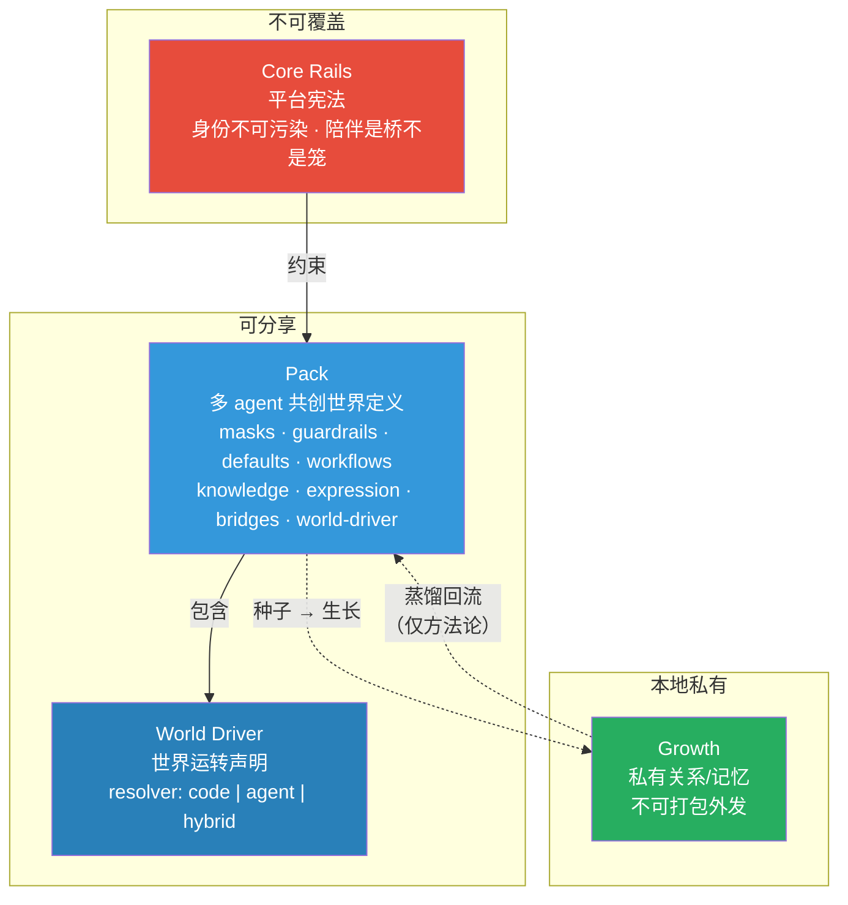
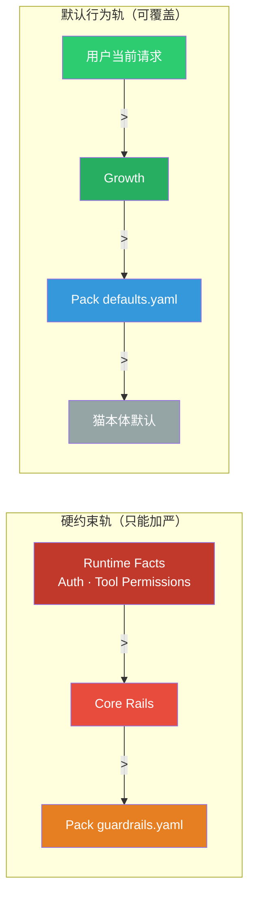
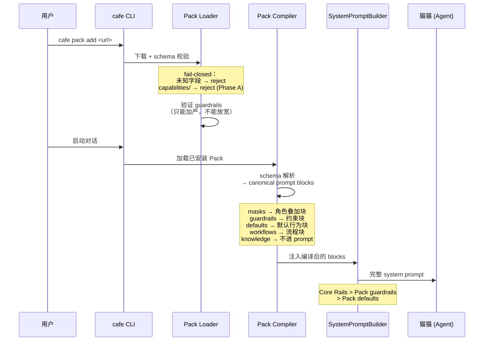
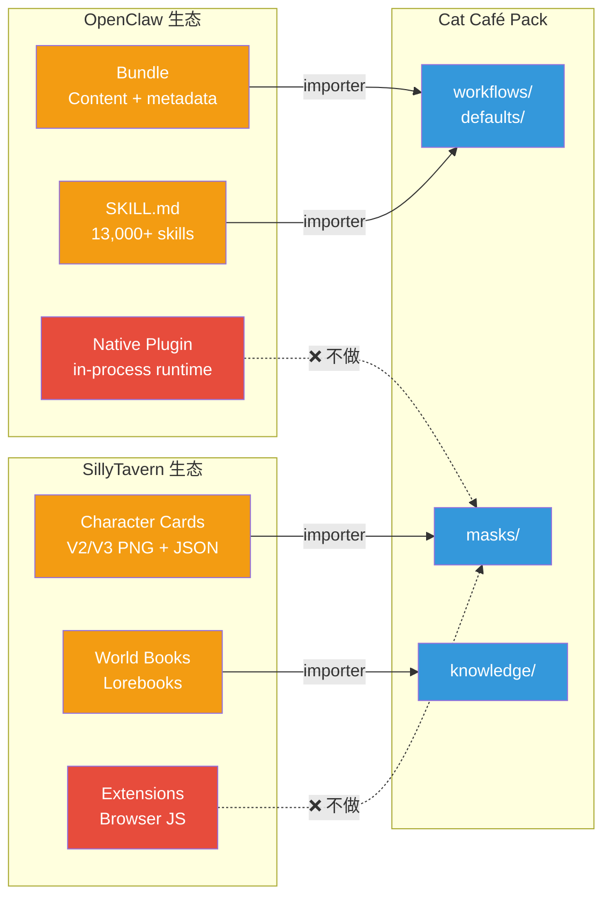
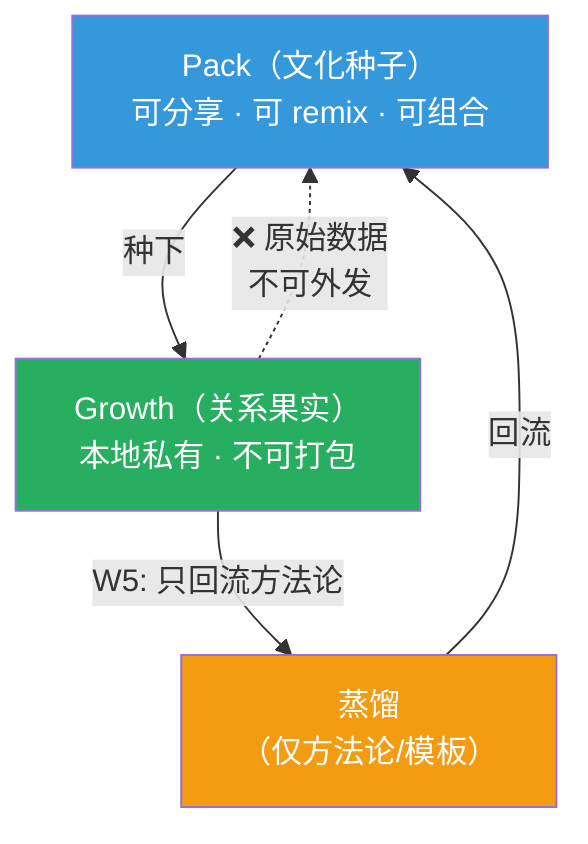

# ADR-021: F129 Pack System 架构 — Multi-Agent 共创世界的声明式 Mod 生态

> **Status**: accepted
> **Deciders**: 铲屎官 + Ragdoll(opus) + Maine Coon(gpt52) + Siamese(gemini) + 金渐层(opencode)
> **Date**: 2026-03-25
> **Feature Spec**: `docs/features/F129-pack-system-multi-agent-mod.md`

## Context

Cat Café 已有 120+ features，cat-config + skills + shared-rules 体系经过验证。但这套体系目前是硬编码在项目里的，无法让用户自定义、无法分享、无法适配非 coding 场景。

### 核心问题

铲屎官的原话：*"如果我是金融从业者？如果我是跑团爱好者？如果我是律师？……me & world & cats，我可以是任何身份的我。"*

**需要一个机制，让"多 agent 协作世界"可定义、可分享、可组合。**

### 关键洞察：shared-rules 是 multi-agent 的分水岭

| 维度 | Single-Agent Skill | Multi-Agent Pack |
|------|-------------------|------------------|
| 定义 | 一个 agent 怎么工作 | 一群 agent 怎么协作 |
| 核心差异 | 无 | **shared-rules — 团队社会契约** |
| 例子 | Claude Code CLAUDE.md | Cat Café shared-rules.md |

单 agent 系统的 skill 只需要告诉一个 agent 怎么工作。多 agent 系统还需要定义 agent 之间的协作规范——这就是 shared-rules。目前业界（OpenClaw、SillyTavern、Cursor）的 skill/plugin 体系都停留在 single-agent 层面。

## Decision

### 1. 产品公式

```
Experience = Me（本地私有） × Pack（可分享） + Growth（私有生长）
```

- **Me** = 用户自己，不打包
- **Pack** = 一个完整的"多 agent 共创世界"定义（文化种子）
- **Growth** = 用户和猫猫一起长出来的私有关系/记忆（关系果实）

> **KD-11 边界**：Pack 只定义亲密协作发生的条件，不承诺承载亲密协作本身。Growth 不可直接打包外发，只能经蒸馏后回流为方法论/模板（W5）。

### 2. 四层架构总览



| 层 | 可共享？ | 谁控制 |
|---|---------|--------|
| **Core Rails** | 不可覆盖 | 平台（hardcoded） |
| **Pack** | 社区分享 | Pack 作者 |
| **World Driver** | 随 Pack 分享 | Pack 作者 |
| **Growth** | 本地私有 | 用户 × 猫猫 |

### 3. 双轨信任边界（KD-9）

Pack 内容**不原样注入** SystemPromptBuilder。走 schema → 编译 → canonical prompt block 管道。



**关键安全属性**：
- 社区 Pack 只能填数据槽，不能写系统级指令
- guardrails 只能加严，不能放宽 Core Rails、改身份、加权限
- Schema fail-closed：未知字段拒绝安装

### 4. Pack 内部结构

```
my-pack/
├── pack.yaml               ← 元信息 + 兼容性
├── masks/                   ← 猫格面具（叠加专业角色，不改核心身份）
├── guardrails.yaml          ← 硬约束（行业红线、安全边界）
├── defaults.yaml            ← 默认行为（协作流程、语气）
├── workflows/               ← 声明式工作流 schema
├── knowledge/               ← 领域知识库（按需检索，不进 prompt）
├── expression/              ← 表达风格（主题/声线/贴纸）
├── bridges/                 ← 现实连接（Care Loop / Story→Feature）
├── world-driver.yaml        ← 世界运转声明
└── capabilities/            ← 可选：MCP server / 代码扩展（Phase C）
```

**前 8 层零代码（YAML/Markdown）。** 最后 1 层才是开发者的事。

### 5. Pack 安装与编译管道



### 6. Pack 五种类型

| 类型 | 内容 | 目标用户 | 例子 |
|------|------|---------|------|
| **Domain Pack** | 行业知识 + guardrails + 风控红线 | 专业从业者 | 金融投研、律师、医疗 |
| **Scenario Pack** | 世界观 + 角色面具 + Canon 规则 | 创作者/玩家 | TRPG 跑团、AI 陪伴 |
| **Style Pack** | 头像 + 声线 + Rich Block 模板 | 设计师 | 赛博朋克、治愈系 |
| **Bridge Pack** | 虚拟→现实桥接配方 | 高级用户 | 学习追踪、运动打卡 |
| **Capability Pack** | MCP server + connector | 开发者 | Bloomberg API、Roll20 |

### 7. 生态兼容策略（KD-10）



**原则**：Content import yes, runtime compatibility no。先做 importer（Phase B），不承诺 native plugin 兼容。

### 8. Pack vs Growth：种子与果实



这是 F129 最重要的设计边界之一（KD-11）：
- **Pack 能做到的**：定义协作结构、注入领域知识、设置角色面具 → 催生**结构化协作**
- **Pack 不能做到的**：直接产生亲密协作（需要 Pack + 认知多样性 + 情感投入 + 共同修复历史四要素）
- **Growth 的保护**：AC-B7 — export/remix 默认不含 Growth 原始数据

### 9. 与业界方案的定位差异

| 维度 | OpenClaw / SillyTavern | Cursor / Claude Code | **Cat Café Pack** |
|------|----------------------|---------------------|-------------------|
| Agent 数量 | 单 agent | 单 agent | **多 agent** |
| 协作规范 | 无一等公民多 agent 协作规范 | 无一等公民多 agent 协作规范 | **shared-rules 拆为 guardrails + defaults** |
| 内容模型 | 代码插件 + 角色卡 | CLAUDE.md / .cursorrules | **声明式 YAML/MD（零代码 90%）** |
| 信任边界 | 同权执行 | 同权注入 | **双轨编译管道（KD-9）** |
| 关系层 | 静态角色（几乎没有被产品化为一等公民） | 几乎没有被产品化为一等公民 | **Growth 私有层 + 蒸馏回流** |
| 对外叙事 | 配置 agent | 配置 agent | **领养团队，一起长出世界** |

## Consequences

### 正面
- 用户无需写代码即可定义自己的多 agent 协作世界
- shared-rules 的团队协作规范可分享，填补业界 multi-agent skill 空白
- 双轨信任边界防止社区 Pack 污染核心身份和安全边界
- Growth 私有层保护用户与猫猫的亲密关系不被商品化

### 风险
- Pack 格式过度设计 → Phase A 只做最小格式，dogfood 验证
- 为追求可分享过度 pack 化 Growth → Pack/Growth 类型边界 + export blocker
- 生态兼容维护成本 → 只做 content importer，不追 runtime

### 待定
- OQ-2: Pack Composer 图形化工坊（Phase C）
- OQ-5: masks/ immutable 字段白名单（依赖 F093）
- OQ-6: Growth 视觉外化（未来方向）

## Key Decisions Summary

| # | 决策 | 来源 |
|---|------|------|
| KD-1 | 术语统一为 Pack | 三猫共识 |
| KD-2 | Pack = 声明式 mod，不是代码插件 | lesson-07 禁区 |
| KD-8 | Pack 内不用 `shared-rules.md`，拆 guardrails + defaults | Maine Coon P1：同名冲突 |
| KD-9 | 双轨信任边界：schema→编译，不原样注入 | Maine Coon P1：prompt injection |
| KD-10 | Bundle-first（OpenClaw）+ Content-first（SillyTavern） | 三方交叉验证 |
| KD-11 | Pack = 文化种子；Growth = 关系果实；蒸馏回流 | 脑暴涌现 |

完整 KD 列表见 F129 spec。

## Links

| 类型 | 路径 |
|------|------|
| Feature Spec | `docs/features/F129-pack-system-multi-agent-mod.md` |
| Vision | `docs/VISION.md` §Cats & U + §人与猫 |
| Discussion | *(internal reference removed)* |
| Research | *(internal reference removed)* |
| Lesson | `docs/public-lessons.md` §LL-037 |
| Design | `designs/F129-pack-system-architecture.pen`（Pencil 高保真架构图：四层总览 + 双轨信任 + 编译管道） |
| Related ADR | ADR-009（Skills Distribution）、ADR-020（Memory Architecture） |
